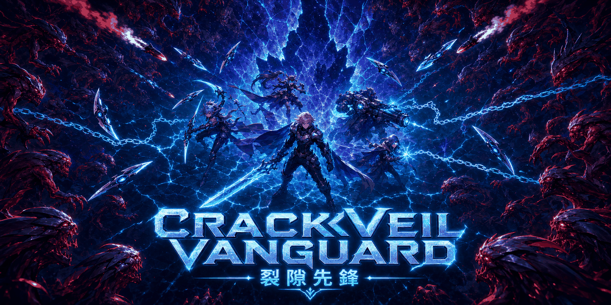
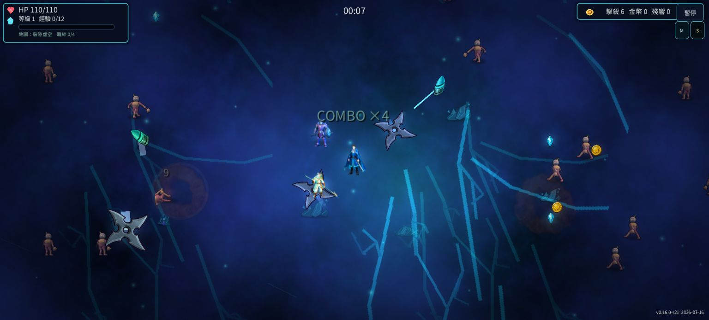
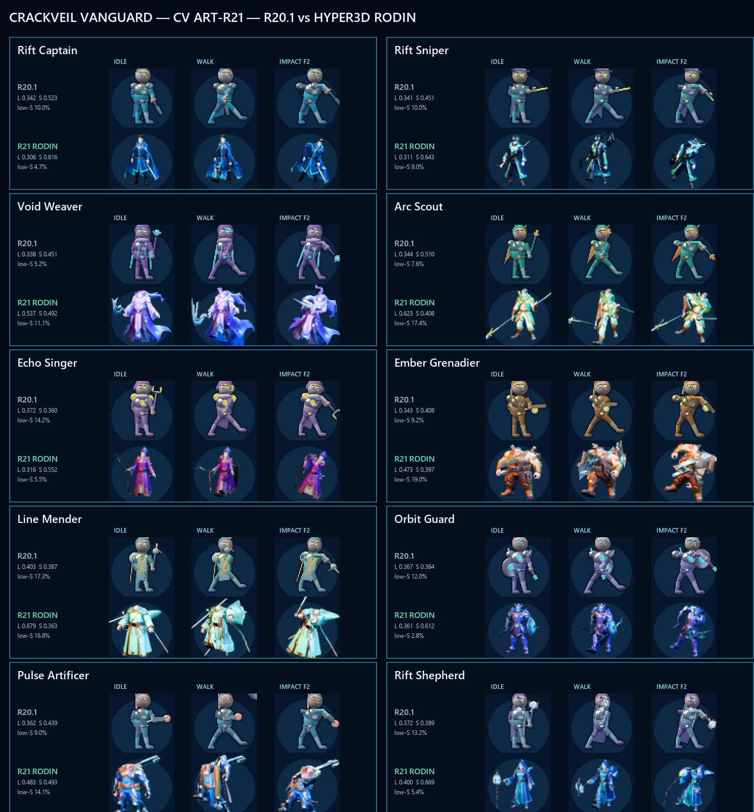
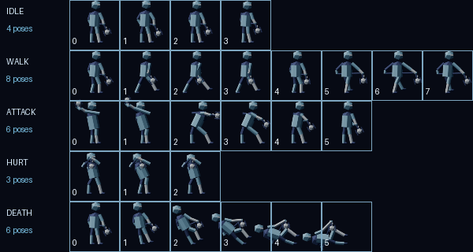

# Crackveil Vanguard

[](https://github.com/mars-tw/crackveil-vanguard/actions/workflows/deploy-web.yml)
[](LICENSE)

[](https://mars-tw.github.io/crackveil-vanguard/)

Crackveil Vanguard 是一款以小隊編成為核心的 2D survivors roguelite。帶領裂隙先鋒進入每局隨機抽選的異變戰場，在自動武器火網中招募英雄、組合羈絆、選擇進化，撐過不斷加壓的敵潮。

目前版本：**0.19.1-r30**（與 `project.godot` 一致）

## 線上遊玩

**[立即遊玩 Crackveil Vanguard](https://mars-tw.github.io/crackveil-vanguard/)**

Web 版不需安裝。首次載入需下載約 40 MB 的 WebAssembly 與遊戲資源，行動裝置建議使用橫向畫面。Web 版不提供完整離線遊玩；斷線重新整理會顯示輕量「需要連線」提示，恢復連線後即可重新載入。

## 最新特色

- **10 位英雄、最多 9 人出擊**：隊長、火力、控場、治療與召喚定位皆有專屬武器與成長路線。
- **真姿勢動畫**：10 位英雄與敵人皆採逐幀姿勢動畫；走路會改變四肢姿勢，攻擊包含預備、命中與收招，傷害鎖定 impact frame，並具受傷與死亡反應。
- **角色藝術 R21 Rodin 量產**：十英雄改以 Blender MCP 的 Hyper3D Rodin 一體模型為底，18 骨逐幀擺姿勢，具完整臉部、角色專屬裝束／道具與暖 key、冷 fill、rim 的 AgX 打光；遊戲仍只載入共用 2D atlas。
- **羈絆系統**：特定英雄同隊會啟用燼脈聯爆、縫獵協議、星盾和聲或牧長裂約；成員倒下時即時重算。
- **UI 與跨裝置修復**：桌機、平板與手機版面分級，修正按鈕間距、勾選框、教學／簡報彈窗、升級卡與觸控目標。
- **11 種武器與質變升級**：裂線、星環、雷鏈、飛彈、榴彈、虛空網、裂光、治療和聲與裂隙建構體等玩法。
- **三種種子化戰場**：裂隙虛空、廢土農野與餘燼裂原，每局依 seed 抽選其一；擊敗 Boss 後可繼續無盡作戰。
- **可重現流程**：支援 run seed、成就、殘響升級、音量、UI scale、高對比與搖桿設定。

## 畫面







## 操作

### 桌機

| 操作 | 按鍵 |
| --- | --- |
| 移動 | `WASD` 或方向鍵 |
| 隊長技（裂隙脈衝） | `Space` |
| 暫停／繼續 | `P` 或 `Esc` |
| 攻擊 | 自動鎖定最近敵人 |
| 選單與升級卡 | 滑鼠點擊 |

### 手機／平板

- 左下虛擬搖桿移動。
- 右下「裂」按鈕施放隊長技。
- 右上按鈕暫停；選單、契約與升級卡直接觸控。
- 武器會自動攻擊，不需要額外瞄準按鈕。

## 技術棧

- Godot 4.7 stable、GDScript、2D `gl_compatibility` renderer。
- HTML5 / WebAssembly 單執行緒匯出，部署至 GitHub Pages。
- Python 3、fontTools、Pillow：字型子集與美術驗證工具。
- GitHub Actions：重建字型、執行素材檢查、匯出並部署 Web build。

## 本地開發

需求：Godot **4.7 stable**、Python 3.10+。clone 後在 repo 根目錄執行：

```powershell
$godot = "C:\path\to\Godot_v4.7-stable_win64_console.exe"
& $godot --editor --path .
```

也可直接用 Godot Editor 開啟 `project.godot`，按 `F5` 從主選單開始。主要目錄：

```text
assets/       遊戲美術、音效與內嵌字型
resources/    Hero、Squad、Weapon 資料資源
scenes/       遊戲、UI 與 regression 場景
scripts/      GDScript runtime 與驗證腳本
tools/        字型／素材建置與檢查工具
docs/         設計、稽核報告與證據圖
```

### 重建繁中字型子集

```powershell
python -m pip install fonttools pillow
python tools/build_font_subset.py
```

腳本會下載 pinned 的 Noto Sans CJK TC Regular 與 `3000-traditional-hanzi` 安全集，掃描 runtime 文字，再重建 `assets/fonts/NotoSansCJKtc-Regular-UI-Subset.otf`。來源與授權見 [CREDITS.md](CREDITS.md)，完整策略見 [docs/WEB_EXPORT.md](docs/WEB_EXPORT.md)。

### 執行 regression tests

```powershell
& $godot --headless --fixed-fps 60 --path . res://scenes/debug/R14RegressionTest.tscn
& $godot --headless --fixed-fps 60 --path . res://scenes/debug/R30PlaytestFixTest.tscn
& $godot --headless --fixed-fps 60 --path . res://scenes/debug/TrueAnimationRegressionTest.tscn
& $godot --headless --fixed-fps 60 --path . res://scenes/debug/R25ParallaxRegressionTest.tscn
& $godot --headless --fixed-fps 60 --path . res://scenes/debug/PoolContractTest.tscn
& $godot --headless --fixed-fps 60 --path . res://scenes/debug/GameplayCapTest.tscn
& $godot --headless --fixed-fps 60 --path . res://scenes/debug/SquadSmokeTest.tscn
& $godot --headless --fixed-fps 60 --path . res://scenes/debug/WeaponSmokeTest.tscn
& $godot --headless --fixed-fps 60 --path . res://scenes/debug/EnemyArtRegressionTest.tscn
```

R14 與 TrueAnimation 是核心回歸門檻；其餘場景覆蓋 pool、cap、小隊、武器與敵人美術契約。成功時各場景以 exit code 0 結束，並輸出對應 `*_PASS` 標記。

## Web 匯出

先安裝 Godot 4.7 官方 export templates，再執行：

```powershell
New-Item -ItemType Directory -Force -Path export/web | Out-Null
& $godot --headless --path . --export-release "Web" "export/web/index.html"
Copy-Item assets/art/cover.png export/web/cover.png
python -m http.server 8067 --directory export/web
```

開啟 `http://127.0.0.1:8067/` 驗證。`export/`、`.wasm`、`.pck` 與產生的 JavaScript 不入庫；`main` 分支由 [Deploy Web workflow](.github/workflows/deploy-web.yml) 自動匯出至 GitHub Pages。更完整的設定與故障排除見 [docs/WEB_EXPORT.md](docs/WEB_EXPORT.md)。

## 授權與 Credits

- 專案程式與專案自有內容採 [MIT License](LICENSE)，版權人為 mars-tw。
- 第三方字型、字集與 CC0／MIT 素材的來源、授權及用途見 [CREDITS.md](CREDITS.md)。
- 逐檔衍生素材與 SHA-256 紀錄見 [assets/CREDITS.md](assets/CREDITS.md)。
- 宣傳素材與簡介見 [PRESSKIT.md](PRESSKIT.md)。
