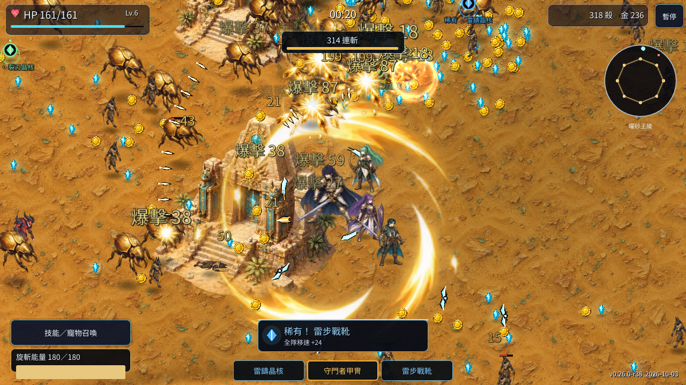

# Crackveil Vanguard

[](https://github.com/mars-tw/crackveil-vanguard/actions/workflows/deploy-web.yml)
[](LICENSE)

[](https://mars-tw.github.io/crackveil-vanguard/)

Crackveil Vanguard 是一款以小隊編成為核心的 2D survivors roguelite。從世界地圖選擇十個異變戰場，在連發火網中招募英雄、組合羈絆、選擇進化，清除怪群並挑戰各關 Boss。

目前版本：**0.26.1-r39**（與 `project.godot` 一致）。`main` 分支通過檢查後自動更新 GitHub Pages。

R39 修正手機操作板遮擋戰場：搖桿與斬擊縮至底部角落，召喚與裝備改為小型入口，自動戰鬥開關移至「暫停 → 本局」。[手機版修正與實測](docs/R39_MOBILE_HUD.md)。

新版改為可持續移動的環狀世界，沿路有八處地標，怪群從畫面外持續湧入。裂線起手每輪 12 發，可升到 20 發；近身範圍斬、按住旋斬與四種可抽法術共同清怪。每個戰場除了 Boss，也有六種特殊菁英；金幣可抽技能與永久寵物。擊敗各關 Boss 後仍可進入對應無盡模式。

[直接遊玩](https://mars-tw.github.io/crackveil-vanguard/)；本次擴充見 [R38 發布報告](docs/R38_RELEASE_REPORT.md)，前一版效能回報見 [戰鬥與效能紀錄](docs/R37_COMBAT_PERFORMANCE.md)。

## 線上遊玩

**[立即遊玩 Crackveil Vanguard](https://mars-tw.github.io/crackveil-vanguard/)**

Web 版不需安裝。R38 的 WebAssembly 與遊戲包合計約 83 MiB，行動裝置建議使用橫向畫面。Web 版不提供完整離線遊玩；斷線重新整理會顯示輕量「需要連線」提示，恢復連線後即可重新載入。

## 最新特色

- **環狀世界與特殊菁英**：4096 × 3072 的週期世界可以持續往外走；八處地標、環狀主路與中央支路維持方向感。六關沿用不同地景色調，各有召喚、衝鋒、護盾、冰霜、火焰與寶藏菁英。
- **大量火力與金幣召喚**：裂線 12／16／20 發，搭配追蹤飛彈、回旋刃與大範圍旋斬；80 金幣抽當局技能、120 金幣抽永久寵物，重複寵物會升星。商店顯示費用、有效候選機率與保底。
- **動漫戰鬥重製**：26 種動漫角色／魔物姿勢素材；新內容有九組各十六個原創姿勢。魔物放大，手繪地面與地標共同構成戰場。
- **踏進拔刀與持續旋斬**：點按空白鍵或右下「斬」，可在準備動作中向外圈目標踏進，近怪時留在原地；按住持續旋斬，放開回能。斬擊在真正 impact frame 命中，敵人有砍飛與死亡反應。
- **直接進場、快速選卡**：開始出擊直接戰鬥，教學可從暫停重看；種子出擊可選戰術契約。桌機可用 1／2／3 選卡，手機單次點選；HUD 頂欄縮至 58 px，裝備以底部短幅演出。
- **裝備掉落與換裝**：武裝核心、護甲、戰靴三槽，精良／稀有／史詩／傳說四品質。裝備有落地光柱與磁吸拾取，較強自動換上，較弱拆成金幣；菁英必掉稀有以上，Boss 必掉傳說。屬性會實際作用於全隊。
- **群怪收割與多殺**：密集怪群提供貫穿與範圍武器的清怪窗口；方向命中碎光、斬殺短弧與三階多殺演出跟隨真實傷害事件。遠程、衝刺與 Boss 彈幕有起手預警。
- **升級與手機體驗**：卡面顯示數值前後、強化階段和選後進化進度；簡報可直接出擊，無法購買有效商品時延後商亭。手機搖桿、連斬面板與裝備列經實玩修正，主角與隊友加上不同顏色的輪廓。
- **13 位英雄、最多 9 人出擊**：新增星焰槍騎、潮汐魔導與影刃遊俠，擁有貫槍易傷、潮汐緩速回復、返場雙刃及各自進化。
- **真姿勢動畫**：13 位英雄與敵人皆採逐幀姿勢動畫；走路會改變四肢姿勢，攻擊包含預備、命中與收招，傷害鎖定 impact frame，並具受傷與死亡反應。
- **可追溯美術**：R34 使用保留原圖與提示詞的 imagegen 姿勢素材；12 個姿勢欄位排成 27 格播放時序，E 圖三種魔物各有 11 個不同原畫。舊版資產保留作歷史參考。
- **羈絆系統**：特定英雄同隊會啟用燼脈聯爆、縫獵協議、星盾和聲或牧長裂約；成員倒下時即時重算。
- **UI 與跨裝置修復**：桌機、平板與手機版面分級，修正按鈕間距、勾選框、教學／簡報彈窗、升級卡與觸控目標。
- **14 種武器與質變升級**：裂線、星環、雷鏈、飛彈、榴彈、虛空網、裂光、治療和聲、裂隙建構體、貫槍、爆潮與返場雙刃等玩法。
- **十關世界地圖**：原本六關之外，新增曜砂王陵、珊潮遺都、月華靈森與時輪工坊。選關分為裂帷群島與遠征新境；新境有新物種、四位守關者與對應無盡模式。
- **可重現流程**：支援 run seed、成就、殘響升級、音量、UI scale、高對比與搖桿設定。

## 畫面



## 操作

### 桌機

| 操作 | 按鍵 |
| --- | --- |
| 移動 | `WASD` 或方向鍵 |
| 隊長技 | 點按 `Space` 拔刀；按住持續旋斬 |
| 金幣召喚 | `B` 或左下「召喚」 |
| 暫停／繼續 | `P` 或 `Esc` |
| 攻擊 | 自動鎖定最近敵人 |
| 選單與升級卡 | 滑鼠點擊 |

### 手機／平板

- 左下虛擬搖桿移動。
- 右下「斬」按鈕：點按拔刀，按住持續旋斬。
- 下方「召喚」抽技能／寵物，「裝備」查看本局裝備與效果。手機預設自動選升級與能量旋斬，可從「暫停 → 本局」切換手動。平板保留手動選卡與較大的作戰視野。
- 右上按鈕暫停；選單、契約與升級卡直接觸控。
- 武器會自動攻擊，不需要額外瞄準按鈕。

## 技術棧

- Godot 4.7 stable、GDScript、2D `gl_compatibility` renderer。
- HTML5 / WebAssembly 單執行緒匯出，部署至 GitHub Pages。
- Python 3、fontTools、Pillow：字型子集與美術驗證工具。
- GitHub Actions：重建字型、執行素材檢查、匯出並部署 Web build。

## 本地開發

需求：Godot **4.7 stable**、Python 3.10+。clone 後在 repo 根目錄執行：

```powershell
$godot = "C:\path\to\Godot_v4.7-stable_win64_console.exe"
& $godot --editor --path .
```

也可直接用 Godot Editor 開啟 `project.godot`，按 `F5` 從主選單開始。主要目錄：

```text
assets/       遊戲美術、音效與內嵌字型
resources/    Hero、Squad、Weapon 資料資源
scenes/       遊戲、UI 與 regression 場景
scripts/      GDScript runtime 與驗證腳本
tools/        字型／素材建置與檢查工具
docs/         設計、稽核報告與證據圖
```

### 重建繁中字型子集

```powershell
python -m pip install fonttools pillow
python tools/build_font_subset.py
```

腳本會下載 pinned 的 Noto Sans CJK TC Regular 與 `3000-traditional-hanzi` 安全集，掃描 runtime 文字，再重建 `assets/fonts/NotoSansCJKtc-Regular-UI-Subset.otf`。來源與授權見 [CREDITS.md](CREDITS.md)，完整策略見 [docs/WEB_EXPORT.md](docs/WEB_EXPORT.md)。

### 執行 regression tests

```powershell
& $godot --headless --fixed-fps 60 --path . res://scenes/debug/R14RegressionTest.tscn
& $godot --headless --fixed-fps 60 --path . res://scenes/debug/R29MenuModalTest.tscn
& $godot --headless --fixed-fps 60 --path . res://scenes/debug/R30PlaytestFixTest.tscn
& $godot --headless --fixed-fps 60 --path . res://scenes/debug/R31EndgameGate.tscn -- --qa-endgame=r31
& $godot --headless --fixed-fps 60 --path . res://scenes/debug/TrueAnimationRegressionTest.tscn
& $godot --headless --fixed-fps 60 --path . res://scenes/debug/R25ParallaxRegressionTest.tscn
& $godot --headless --fixed-fps 60 --path . res://scenes/debug/PoolContractTest.tscn
& $godot --headless --fixed-fps 60 --path . res://scenes/debug/GameplayCapTest.tscn
& $godot --headless --fixed-fps 60 --path . res://scenes/debug/SquadSmokeTest.tscn
& $godot --headless --fixed-fps 60 --path . res://scenes/debug/WeaponSmokeTest.tscn
& $godot --headless --fixed-fps 60 --path . res://scenes/debug/EnemyArtRegressionTest.tscn
& $godot --headless --fixed-fps 60 --path . res://scenes/debug/CombatR32RegressionTest.tscn
& $godot --headless --fixed-fps 60 --path . res://scenes/debug/R32LootTest.tscn
& $godot --headless --fixed-fps 60 --path . res://scenes/debug/R32ExperienceTest.tscn
& $godot --headless --fixed-fps 60 --path . res://scenes/debug/ReviewR32IntegrationTest.tscn
& $godot --headless --fixed-fps 60 --path . res://scenes/debug/SpawnDensityR32Test.tscn
```

R14、R31 Endgame 與 TrueAnimation 是核心回歸門檻；其餘場景覆蓋選單模態、真人試玩修正、pool、cap、小隊、武器與敵人美術契約。R31 hook 還要求 debug build 與命令列 user arg，Web release preset 會排除 `scripts/debug/**`、`scenes/debug/**`。成功時各場景以 exit code 0 結束，並輸出對應 `*_PASS` 標記。

R32 新增戰鬥、掉裝、整合、獨立覆核與敵潮密度五組門檻。驗收也檢查 log 不含 `SCRIPT ERROR`，不能只看 exit code 或 PASS 文字。載入錯誤與重試可用 `node tools/test_r32_loading_recovery.mjs` 驗證。

## Web 匯出

先安裝 Godot 4.7 官方 export templates，再執行：

```powershell
New-Item -ItemType Directory -Force -Path export/web | Out-Null
& $godot --headless --path . --export-release "Web" "export/web/index.html"
Copy-Item assets/art/cover.png export/web/cover.png
python -m http.server 8067 --directory export/web
```

開啟 `http://127.0.0.1:8067/` 驗證。`export/`、`.wasm`、`.pck` 與產生的 JavaScript 不入庫；`main` 分支由 [Deploy Web workflow](.github/workflows/deploy-web.yml) 自動匯出至 GitHub Pages。更完整的設定與故障排除見 [docs/WEB_EXPORT.md](docs/WEB_EXPORT.md)。

## 授權與 Credits

- 專案程式與專案自有內容採 [MIT License](LICENSE)，版權人為 mars-tw。
- 第三方字型、字集與 CC0／MIT 素材的來源、授權及用途見 [CREDITS.md](CREDITS.md)。
- 逐檔衍生素材與 SHA-256 紀錄見 [assets/CREDITS.md](assets/CREDITS.md)。
- 宣傳素材與簡介見 [PRESSKIT.md](PRESSKIT.md)。
## R37 更新

地面加入較暗的野地、暖色環道與路肩，八處地標移出主要通路。魔物攻擊的危險邊界與方向更清楚；傷害文字保留描邊，減少重複文字節點、字體排版與空場查詢。觸控按鈕、搖桿及裝備列在手機與平板橫、直向皆保留間距。

未錄影的 Chrome 實玩中，桌機 30 秒與手機尺寸 45 秒的 FPS 中位數均為 60；這是指定硬體、種子及觸控模擬的結果，實體行動裝置仍需個別驗證。完整數據、候選版本雜湊與限制見發布報告。
