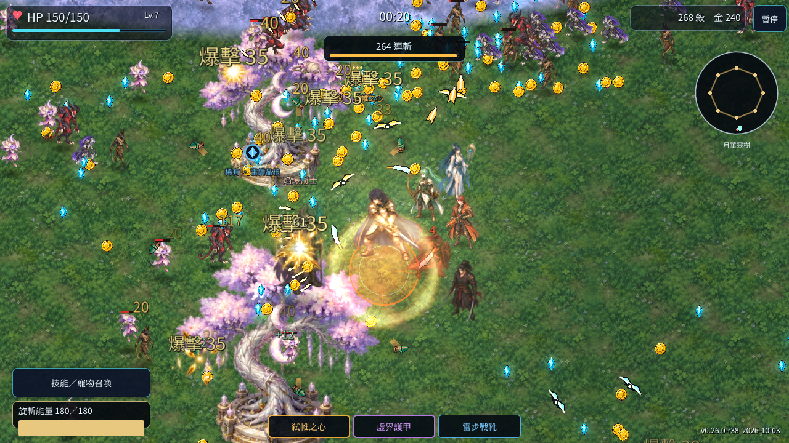
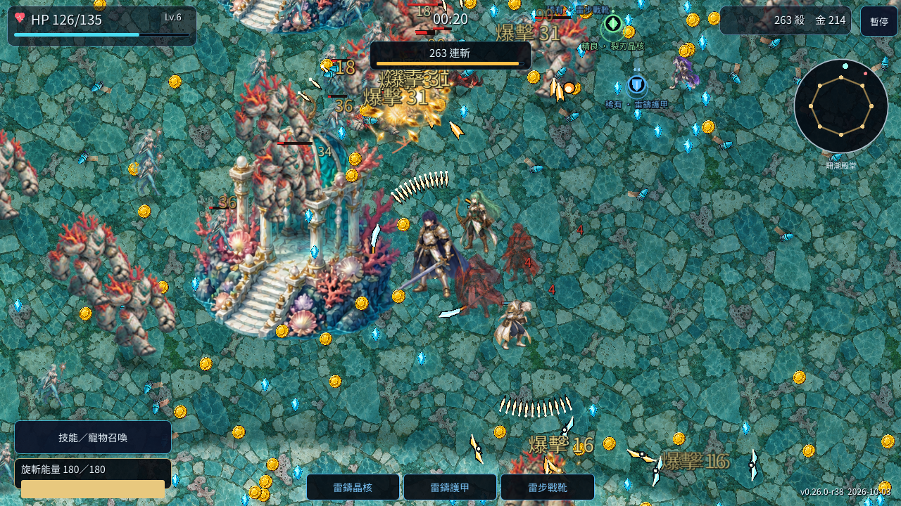
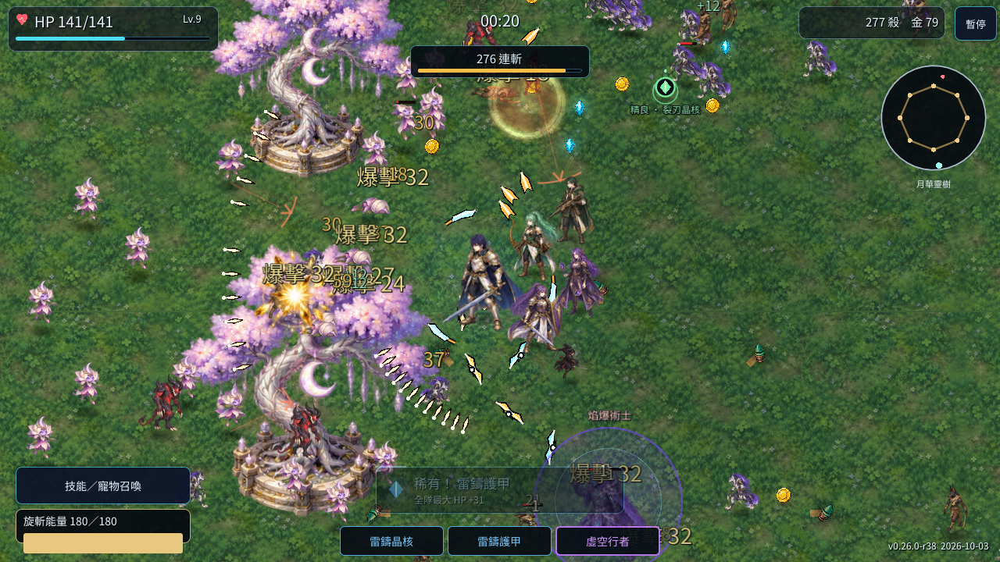
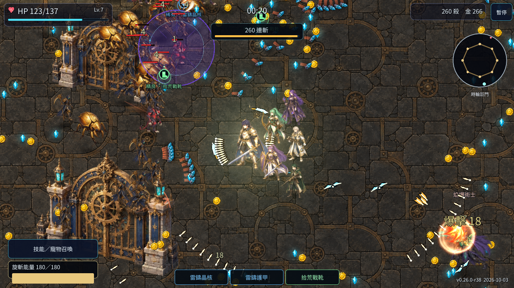

# R38 遠征新境

版本 `0.26.0-r38`。本輪增加四個遠征地區、三位英雄、六種普通魔物與四位守關者，全部接入可玩的關卡、招募與戰鬥。

## 四個新地區

| 地區 | 新敵潮 | 守關者與招式 |
| --- | --- | --- |
| 曜砂王陵 | 曜砂甲蟲、砂影獵手 | 曜砂巨甲；三列錯位瞄準砂彈，半血增加彈量。 |
| 珊潮遺都 | 深潮歌妖、珊瑚巨衛 | 深潮歌后；雙臂轉向水彈螺旋。 |
| 月華靈森 | 月華靈火支援敵群、砂影獵手突進 | 萬花靈主；六瓣月華交錯成環，支援附近敵群。 |
| 時輪工坊 | 時輪刃衛與曜砂甲蟲 | 時輪收割者；四軸旋轉齒輪、快慢層交錯彈幕。 |

各地區沿用可持續移動的週期世界，新增沙金石地、珊潮拼石、黃銅齒紋地材，以及王陵、石碑、珊潮殿堂、燈塔、月華樹、花冠聖祠、時輪門與星齒塔。世界地圖分成六關原域與四關新境，手機、平板可切換分章。

擊敗守關者仍掉傳說裝備、保存通關記錄，並解鎖該關無盡模式。既有六關存檔 ID 保留，通過帷幕王庭後可接續遠征新境。

## 三位新英雄

- 星焰槍騎：多列穿透槍刺、灼星易傷，進化為日冕槍陣。
- 潮汐魔導：爆潮緩速、附近隊友回復，進化後追加六發追蹤水晶。
- 影刃遊俠：成對投刃與返場再命中，進化提升實際回程傷害。

英雄名單為十三人，隊伍最多九人。新英雄可從升級與有空位時的技能召喚卡招募；三種武器各有質變、數值擴張及進化。

## 動畫與驗證

九個新角色各有十六個原創姿勢：兩格待機、四格行走、六格攻擊、兩格受傷與兩格死亡，共 144 個原創姿勢。每格攻擊有準備、命中與收招，傷害仍在第 2 幀生效。圖集只做原始 RGBA 主體擷取與等比例打包，沒有程序畫身體或晃動單張圖片代替動作。

35 個遊戲回歸場景通過。新內容檢查實際運行十位 Boss 的前後半血招式、死亡、傳說裝備、10／10 存檔與工坊無盡進場；新英雄檢查實際招募、物理投射物碰撞、返場重擊、回復、進化及重新開局。選關與十套背景在五種尺寸下有獨立檢查。

素材原圖、全部生成與間距修復提示、來源雜湊及重建工具保留於 [R38 素材目錄](../assets/art/r38/README.md)。詳見 [英雄與武器](PROGRESSION_R38.md)、[關卡與魔物](R38_STAGES_ENEMIES.md)。

## 實際 Web 遊玩

體驗員逐一從世界地圖切至新章，實際進入四個新區域，使用鍵盤、升級卡與隊長技清怪。各區有不同新物種實際生成，桌機每區約 20 秒的活動取樣平均 58.91–60 FPS；珊潮遺都另用 844×390 觸控模擬遊玩約 30 秒，平均 59.81 FPS、最低 58。這些是 Intel ANGLE 的短局取樣，未見腳本或 WebGL 錯誤，並非所有裝置或長局的效能保證。

自然升級實際抽到並招募星焰槍騎；實玩抓到身形偏小後，三位新英雄的固定顯示比例已按原隊員大小修正。修正後再從正常升級招募影刃遊俠與潮汐魔導，戰鬥畫面中的身形已與原隊員相當。星焰此次以原圖量測驗證倍率，沒有冒稱第二次實際招募。詳細前後量測見英雄文件；四區與招募紀錄見 [實玩摘要](evidence/r38/playtest_summary.json)。

實體行動裝置與完整自然十關通關未由受控測試替代；新地材對邊像素不是完全一致，實際重複紋理與效能另依 Web 實玩紀錄核對。
