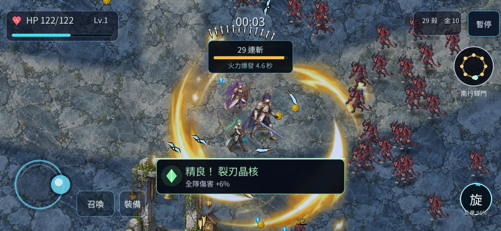
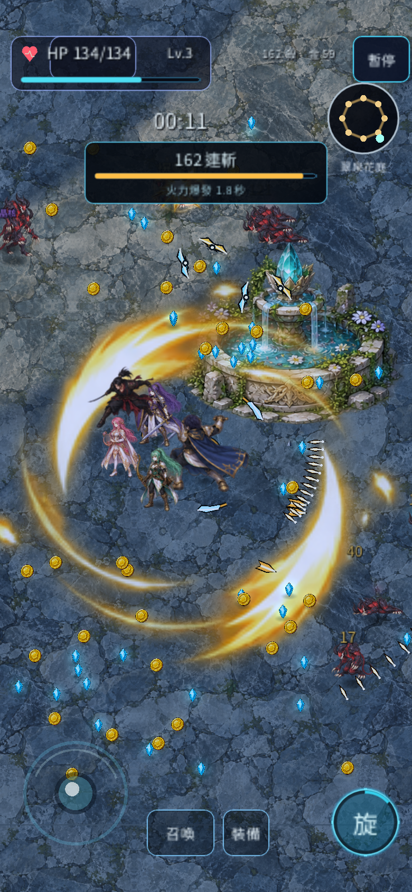

# R39 手機操作板修正

版本 `0.26.1-r39`，2026-10-05。

原手機召喚與自動戰鬥兩塊 136×56 操作板位於橫向畫面的 y≈147，會蓋住左側來怪與攻擊範圍。直向畫面也有中段操作板、常駐三格裝備與過大的搖桿。舊檢查只確認按鈕彼此不重疊，沒有確認中央戰鬥區保持清楚；實玩另抓到直向暫停按鈕越界、旋轉後斬擊保留舊尺寸。

本次僅重新安排手機戰鬥 HUD：

- 搖桿固定在左下角，預設觸控熱區約 99～119 px；待機只顯示淡色提示，按住時加強輪廓。
- 右下斬擊為 56／60／64 px，冷卻與能量留在同一個圓內，旋轉後重新收斂真正尺寸。
- 召喚改為 64×44，裝備入口為 44×44，排在下緣。裝備名稱與效果改由「暫停 → 本局」查看，裝備自動換裝與屬性作用維持原規則。
- 自動戰鬥開關移至「暫停 → 本局」，不再用整塊操作板遮住戰場。
- 手機血量板、暫停與小地圖縮小；短提示移至上方，保留原本相機倍率與角色大小。
- 暫停、召喚視窗、旋轉、隱藏或失焦時清除舊觸控與按住施法。觸控持有搖桿時忽略模擬滑鼠事件，避免兩指操作互相干擾。

六種手機尺寸的受控實際控制測試已通過：844×390、390×844、360×640、320×568、667×375、640×360。四個主要操作區的矩形面積合計為螢幕的 6.15%～9.754%，中央指定戰鬥區沒有操作控件相交；此數據指觸控區面積，並非不透明像素比例。44 px 以上的觸控目標、同局旋轉、暫停與召喚後不殘留移動／按住狀態皆有驗證。

桌機、平板與原有召喚／自動施法另做相關回歸檢查。瀏覽器的手機觸控實玩與畫面見 [實玩摘要](evidence/r39/after_summary.json)。同一橫向尺寸下，包含暫停鍵的五個輸入區面積由 14.77% 降為 6.88%；實際斬擊旋轉尺寸為 60→64→60。召喚入口另在乾淨單指操作中確認可保持開啟，再正常返回戰場。本次以 Chrome 觸控模擬與隔離控制場景驗證，未冒稱已測試實體手機硬體。

驗證場景為 `scenes/debug/R39MobileHUDTest.tscn`。最初測到按鈕仍被舊字級撐成 73 px 後，修正字級與尺寸設定順序；暫停頁增加開關造成短視口滑桿超出可視區後，將當局開關移至「本局」頁。最初失敗保留於本機紀錄，最終 [控制結果](evidence/r39/mobile_hud_test.json) 沒有失敗項目。
