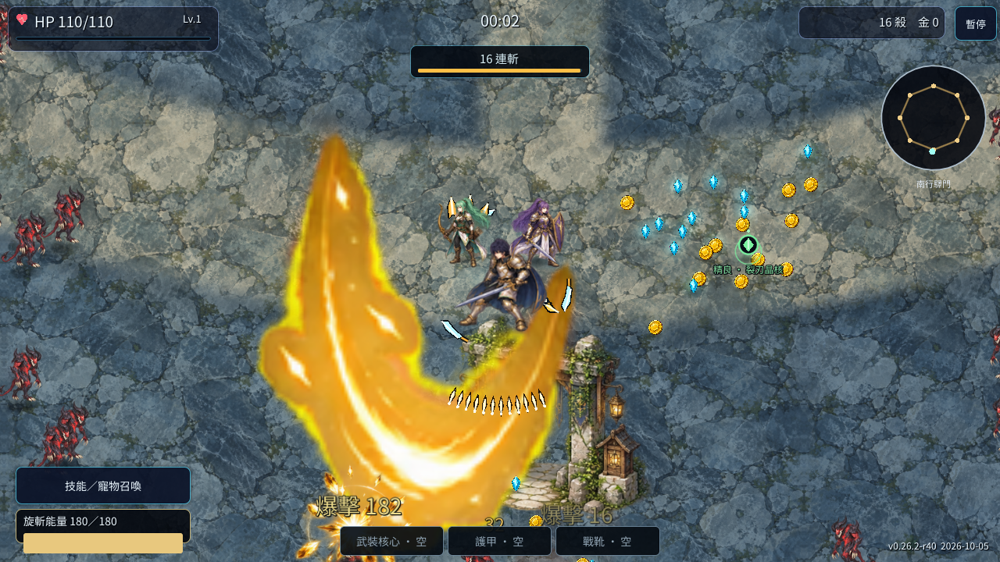

# R40 移動與攻擊方向修正

版本 `0.26.2-r40`，2026-10-05。

原本 Hero 每個物理幀會朝最近敵人轉向，Visual 的行走更新又朝移動方向轉向，兩套判定會互相覆蓋。牧者開始施法只更新畫面面向，沒有同步 Hero 的攻擊方向鎖；下一個物理幀便可能把施法姿勢改回舊方向。純上下移動也會取消先前的左向鏡像。

本版將面向集中於同一套判定：

- 行走跟隨目前移動方向，停止後保留最後方向。
- 隊長拔刀、連斬、旋斬、牧者施法與三位新英雄共用成功出手入口；動畫接受出手後，才保存朝向。被忙碌動畫拒絕的出手不改方向。
- 近戰前搖、命中與收招保持同一個方向。移動輸入反向或目標跨到背面時，這次攻擊不轉向；下一次出手再重新瞄準。
- 傷害仍在真正第 2 幀生效，斬擊特效沿用相同方向。受傷、死亡不會被舊攻擊方向翻回右側。
- 同一幀按方向鍵與空白鍵時，先採樣移動輸入；沒有目標的拔刀可使用新輸入方向。重新開局會重置面向。
- 隊友隊形使用移動方向，不會因隊長近戰改朝另一個目標而反覆旋轉。

本版沿用原有逐格姿勢與左右鏡像。上下方向保留先前的水平側，邏輯面向、腳下方向標記與斬擊幾何仍使用完整二維向量；人物原畫目前是三分之四視角，不是新增四向或八向背面素材。追蹤魔法的落點與原有有效目標／回收代次規則維持原設計。

受控驗證包含四個方向的手動及自動近戰，共八種情境；每個情境都在實際第 2 幀命中前方，背面與前搖中跨到背面的敵人未受傷。另核對實際特效朝向／位置、改變移動輸入時的方向鎖、同幀操作、受傷與死亡、重新開局，以及牧者與三位新英雄的左向出手。結果見 [方向驗證](evidence/r40/facing_attack_test.json)。

既有姿勢動畫、連斬、持續旋斬、戰鬥、踏進拔刀、新英雄武器與選單版面七組相關回歸亦通過；見 [回歸摘要](evidence/r40/targeted_gates.json)。最初測試場仍留著星環投射物造成前搖額外傷害，已正確隔離測試場的星環物件，沒有放寬第 2 幀或背面零傷害的條件。

瀏覽器實玩與方向讀回見 [實玩摘要](evidence/r40/after_summary.json)。瀏覽器測試採自然操作，不把受控測試佈置的敵人當成自然實玩成果。

