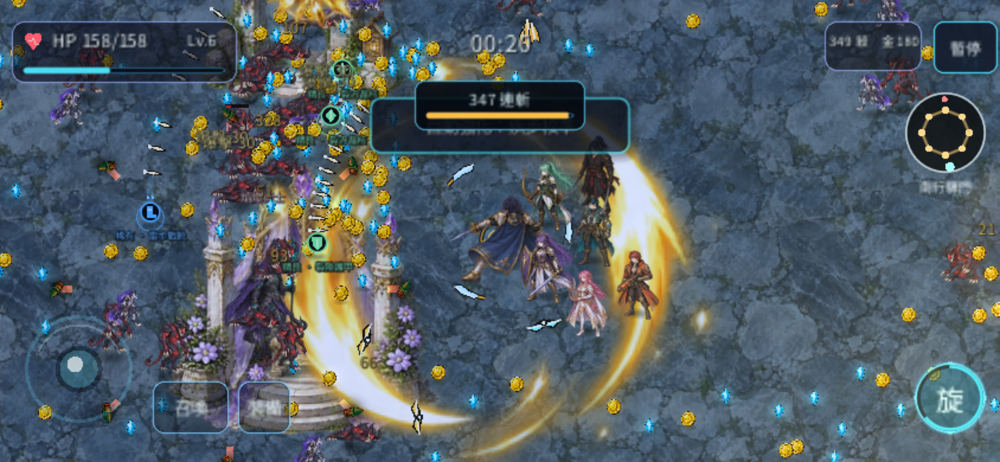

# R41 iPhone 載入優化

版本 `0.26.3-r41`，2026-10-06。玩家回報 iPhone 14 載入後無法進入遊戲，本輪優先降低啟動配置與手機渲染負擔。

## 已修改

- 手機循序執行引擎初始化、遊戲包下載與遊戲啟動，避免原本 WASM 編譯與大包下載同時配置。保留單執行緒與 Godot 支援的公開 Engine API。
- 手機畫布採 CSS 尺寸並限制像素上限，瀏覽器原本的 DPR 不被覆寫。高密度螢幕會較柔和，換取較低的 GPU 緩衝與像素填色負擔；介面仍按 CSS 尺寸排版。
- 載入畫面共用一個外部封面 URL，移除數 MB 的內嵌 base64 複本與大圖引擎 splash。
- 手機主選單不建立被封面遮住的地形與地標。進入關卡才使用戰場資源；移除未使用的歷史圖集預熱與打包。
- 十一份非角色貼圖採較小的匯入尺寸與磁碟壓縮。原始 PNG、角色與技能圖集、簽章來源均保留原樣；怪量、傷害、命中幀與角色姿勢沒有更改。
- 下載完成後若啟動停滯，會顯示可重試的提示；啟動失敗不會被後續 ready 狀態掩蓋。載入 DOM 移除時也解除暫時的事件監聽。

## 套件與匯入量測

| 項目 | 修正前 | 修正後 |
| --- | ---: | ---: |
| 本機 Web PCK | 47,267,208 bytes | 19,631,328 bytes |
| HTML 載入殼 | 約 3.8 MB | 22,505 bytes |
| 引擎 splash PNG | 約 2.83 MB | 21,443 bytes |
| 十一份匯入貼圖 | 26.40 MiB | 4.46 MiB |
| 上述貼圖含 mip 的像素量估算 | 76.00 MiB | 48.13 MiB |

WASM 仍約 39.51 MB；WASM 與 PCK 合計由約 82.76 MiB 減至 56.40 MiB。這些是套件大小與貼圖估算，不等同 Safari 的實際記憶體峰值。

## 驗證範圍

實際輸出 HTML 有獨立的語法與啟動入口檢查，確認手機使用循序入口、桌機保留原路徑；另測試 100% 初始化停滯、失敗鎖定與事件監聽清理。八項相關遊戲回歸通過，包含原創動畫、素材、十地圖、手機 HUD 與近戰方向。

另新增實際資源預算檢查：關卡貼圖最長邊不超過 1024、主選單封面不超過 1536、歷史圖集不預熱，以及手機主選單不初始化地形。

同一 Chrome 手機尺寸對照中，844×390／DPR 3 的實際畫布由 2532×1170 降為 844×390。主選單程序 private commit 合計約 1,014 MB→713 MB，採樣峰值約 1,327 MB→1,148 MB；此合計不是 Safari 用量或 GPU VRAM。新版完成循序啟動、自然遊玩約二十秒，沒有 crash、context loss 或 script error。

並非所有指標都改善：冷啟動約 3,095→3,209 ms，WASM 配置容量約 150→167 MB，戰鬥長任務也增加。兩局使用不同自然種子、升級與羈絆，因此無法以此證明戰鬥全面加速；來源沒有變更怪量、傷害、角色姿勢或相機參數。完整限制見 [量測說明](evidence/r41/MEASUREMENT_REPORT.md)。

Chrome 手機觸控模擬的前後壓力量測見 [基準](evidence/r41/baseline.json) 與 [最終實測](evidence/r41/after.json)。使用相同桌機、瀏覽器及 DPR 3，保留記憶體 capacity、程序 private commit、長任務與限制，不以其中一項數字代表全部 RAM。未修正啟動入口的中途候選另留本機紀錄，未混成最終結果。

本輪未接入玩家的實體 iPhone 14，不能聲稱已重現或完全排除其死當。新版已針對可證實的配置風險減量，仍需該裝置確認是否能進場。Godot 官方說明單執行緒 Web 匯出可用於 iOS，並提醒行動端的 CPU／GPU 負擔與 WebGL 相容性；本輪保留該設定。[Godot Web 匯出說明](https://docs.godotengine.org/en/stable/tutorials/export/exporting_for_web.html)

